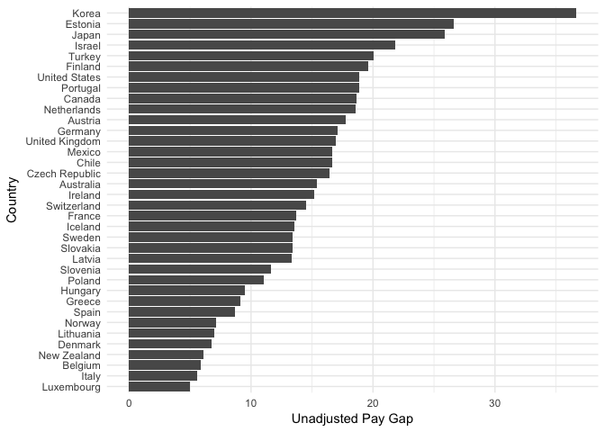
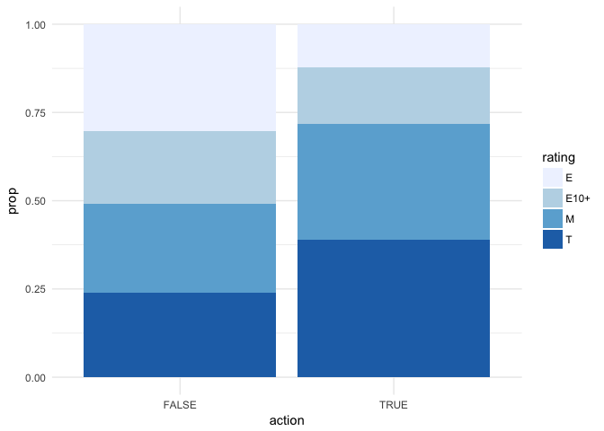
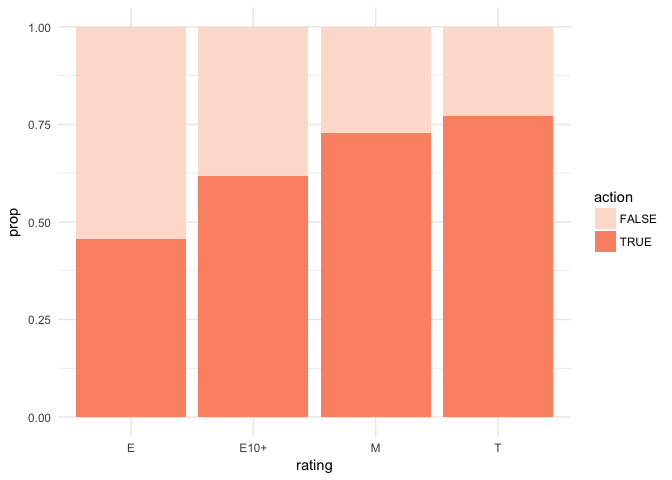
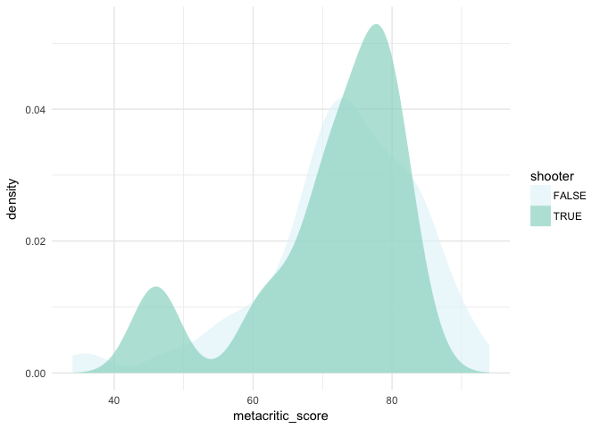
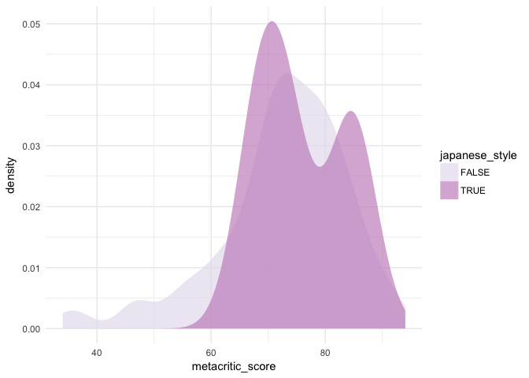
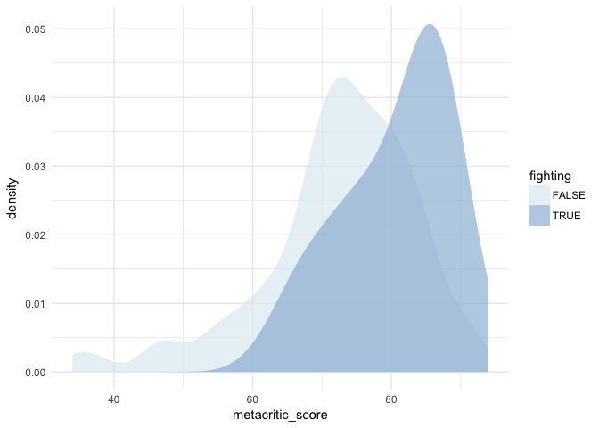

HW 06 - Scrape and analyze
================
Miles Turpin
4/15/18

### Question 1

``` r
library(tidyverse)
```

    ## ── Attaching packages ──────────────────────────────────────────────────────────────────────────────── tidyverse 1.2.1 ──

    ## ✔ ggplot2 2.2.1     ✔ purrr   0.2.4
    ## ✔ tibble  1.4.2     ✔ dplyr   0.7.4
    ## ✔ tidyr   0.8.0     ✔ stringr 1.3.0
    ## ✔ readr   1.1.1     ✔ forcats 0.3.0

    ## ── Conflicts ─────────────────────────────────────────────────────────────────────────────────── tidyverse_conflicts() ──
    ## ✖ dplyr::filter() masks stats::filter()
    ## ✖ dplyr::lag()    masks stats::lag()

``` r
library(forcats)
library(infer)
library(splitstackshape)
paygap <- read_csv("data/paygap.csv")
```

    ## Parsed with column specification:
    ## cols(
    ##   country = col_character(),
    ##   pay_gap = col_double(),
    ##   year = col_integer()
    ## )

### Question 2

``` r
paygap %>% 
  ggplot(aes(x = fct_reorder(country, pay_gap), y = pay_gap)) +
  geom_col() +
  coord_flip() + 
  labs(y = "Unadjusted Pay Gap", x = "Country") + 
  theme_minimal()
```



The unadjusted gender wage-gap is defined by the OECD as "the difference between median earnings of men and women relative to median earnings of men." For example, the pay gap in the US according to this chart is 17%. This means that for every dollar a median income man in the US makes, the median income woman makes 83 cents.

### Question 3

``` r
games_df <- read_csv("data/games.csv")
```

    ## Parsed with column specification:
    ## cols(
    ##   num_meta = col_integer(),
    ##   num_user = col_integer(),
    ##   genres = col_character(),
    ##   rating = col_character(),
    ##   url = col_character(),
    ##   game_title = col_character(),
    ##   metacritic_score = col_integer(),
    ##   user_score = col_double(),
    ##   release_date = col_character()
    ## )

### Question 4

``` r
games_df <- games_df %>% 
  separate(game_title, into = c("game_title", "platform"), sep = "\\(") %>% 
  mutate(platform = str_remove(platform, "\\)"))
```

### Question 5

``` r
games_df_action <- games_df %>% 
  mutate(action = str_detect(genres, "Action"))
```

### Question 6

``` r
counts <- games_df_action %>% 
  filter(!is.na(action), !is.na(rating)) %>% 
  count(rating, action) %>% 
  group_by(rating) %>% 
  mutate(prop = n/sum(n))

counts %>%  
  group_by(action) %>% 
  mutate(prop = n/sum(n)) %>% 
  ggplot(aes(x = action, y = prop,  fill = rating)) + 
  geom_col(position = "stack") +
  scale_fill_brewer() +
  theme_minimal()
```



``` r
counts %>% 
  group_by(rating) %>% 
  mutate(prop = n/sum(n)) %>% 
  ggplot(aes(x = rating, y = prop,  fill = action)) + 
  geom_col(position = "stack") +
  scale_fill_brewer(palette = "Reds") + 
  theme_minimal()
```



In the first visualization, we look at non-action games and see how they are ranked. We clearly see a relationship that action games are more likely to be mature games than non-action games. The next visualization shows us how the each rating category breaks down into action and non-action games. The trend is clear — more mature games tend to be action games.

### Question 7

``` r
# clean data
games_genres <- games_df %>% 
  filter(!is.na(genres)) %>% 
  mutate(genres = str_to_lower(genres)) %>% 
  mutate(genres = str_replace(genres, "2d", "two_d"),
         genres = str_replace(genres, "-", "_"),
         genres = str_replace(genres, "japanese-style", "japanese_style"))

# split up genres
games_genres_long <- games_genres %>%
  cSplit(splitCols = "genres", sep = ", ", direction = "long") %>% 
  as.data.frame()

# most frequent genres
games_genres_long %>% 
  count(genres) %>% 
  arrange(desc(n))
```

    ## # A tibble: 69 x 2
    ##    genres               n
    ##    <fct>            <int>
    ##  1 action              86
    ##  2 general             68
    ##  3 action adventure    49
    ##  4 role_playing        34
    ##  5 arcade              30
    ##  6 two_d               29
    ##  7 shooter             26
    ##  8 adventure           24
    ##  9 platformer          21
    ## 10 first_person        18
    ## # ... with 59 more rows

``` r
genres_list <- c("shooter", "japanese_style", "fighting")

# function to do one hot encoding of each genres attr
one_hot <- function(genres_attr) {
  tbl <- tibble(action = NA)
  for (genre in genres_list) {
    tbl <- tbl %>% 
      mutate(!! quo_name(enquo(genre)) := str_detect(genres_attr, genre))
  }
  return(tbl)
}

# do one hot encoding for all genres attr and merge
genres_one_hot <- map_df(games_genres$genres, one_hot)
games_genres <- cbind(games_genres, genres_one_hot)
```

``` r
color_picker <- function() {
  var <- runif(1)
  if (var < 0.25) {
    return("BuGn")
  } else if (var < 0.5) {
    return("OrRd")
  } else if (var < 0.75) {
    return("PuRd")
  } else {
    return("BuPu")
  } 
}

# create function to do analysis for indefinite number of genres
genre_significance_finder <- function(quo_genre) { 
  
  color <- color_picker()
  
  quo_name_genre <- quo_name(quo_genre)
  genre_stats <- games_genres %>% 
    group_by(!! quo_genre) %>% 
    summarise(mean_meta = mean(metacritic_score))
  g <- games_genres %>%
    ggplot(aes_string(x = quote(metacritic_score), fill = quo_name_genre)) +
    geom_density(alpha = 0.7, size = 0) +
    theme_minimal() +
    scale_fill_brewer(palette = color)
  print(g)
  
  return(genre_stats)
  
}

# list of genres to analyze
genres_list_t <- c(quo(shooter),quo(japanese_style), quo(fighting))
# map over list applying analysis function
map_df(genres_list_t, genre_significance_finder)
```



    ## # A tibble: 6 x 4
    ##   shooter mean_meta japanese_style fighting
    ##   <lgl>       <dbl> <lgl>          <lgl>   
    ## 1 FALSE        72.9 NA             NA      
    ## 2 TRUE         71.1 NA             NA      
    ## 3 NA           72.6 FALSE          NA      
    ## 4 NA           75.8 TRUE           NA      
    ## 5 NA           72.5 NA             FALSE   
    ## 6 NA           80.6 NA             TRUE

From these visualizations we can see trends in how different types of games are received by critics. For the "shooter" games in the data set, we can clearly see that many shooter games tend to be better than not, but a few are consistently terrible. For japanese style games we see a similar bimodal distribution straddling the peak of non-japanese style games, suggesting these games sometimes are hits, sometimes misses. Finally, fighting games are consistently rated highly by a wide margin.
